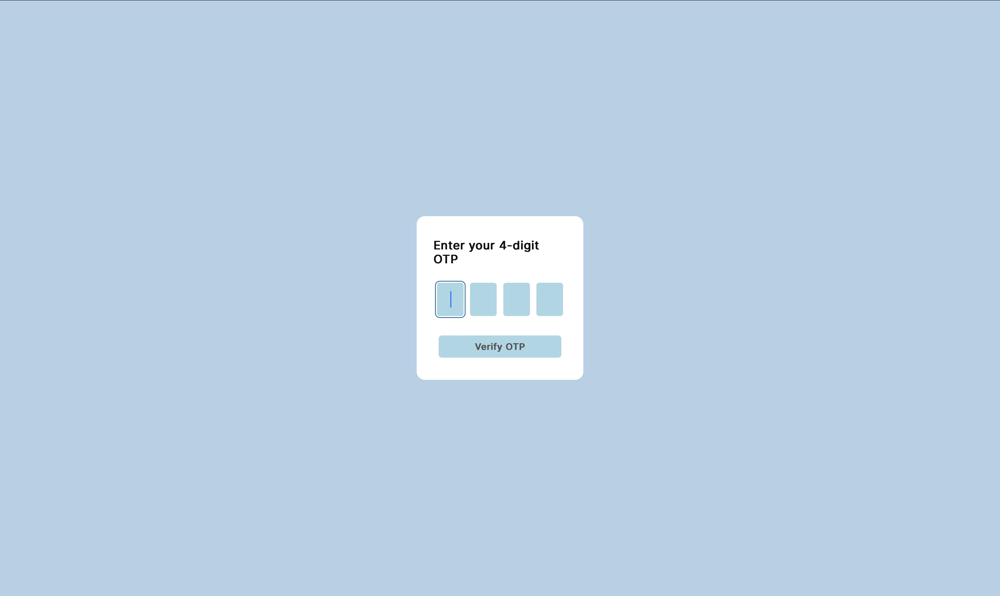

# OTP Verification Form

A simple OTP (One-Time Password) verification form implemented in HTML, CSS, and JavaScript. This form is designed to receive a 4-digit OTP for verification.

## Features

- Responsive and user-friendly design.
- Automatically focuses on the first input field when the page loads.
- Dynamically enables the next input field as the user enters the OTP.
- Disables the 'Verify OTP' button until all input fields are filled.
- Redirects to a different page based on the entered OTP (current implementation includes a playful example).

## How to Use

1. Open the `index.html` file in a web browser.
2. Enter a 4-digit OTP in the input fields.
3. Click the 'Verify OTP' button.
4. If all input fields are filled, the button will activate, and you will be redirected based on the entered OTP.

## Preview

**Live Demo:** [OTP Verification Form - Live Demo](https://otp-verification-alpha.vercel.app)

## Technologies Used

- HTML
- CSS
- JavaScript

## Styling

The styling is done using the Inter font from Google Fonts and features a clean and modern look.

## Implementation Details

- The `input` fields are set to `type="number"` to ensure numerical input only.
- The `button` is initially disabled and becomes active when all OTP input fields are filled.
- The form includes error handling to alert users if not all OTP inputs are filled.

Feel free to explore and use this OTP Verification Form for your projects!

**Note:** The current implementation includes a playful example that redirects to a "rick roll" page based on the entered OTP. Modify the `redirectToDifferentPage` function for your desired functionality.

---

**Author:** Sajit Magesh

**Connect with Me:**
- [LinkedIn](https://www.linkedin.com/in/heysajit/)
- [Twitter](https://twitter.com/tednotswarley)
